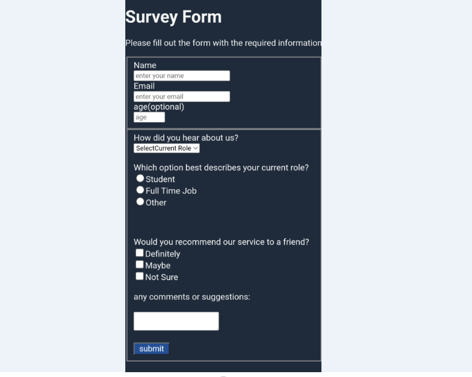

# FreeCodeCamp - Survey Form

This is a solution to the [Survey Form Sertification Project](https://www.freecodecamp.org/learn/2022/responsive-web-design/build-a-survey-form-project/build-a-survey-form).  

## Table of contents

- [Overview](#overview)
  - [The challenge](#the-challenge)
  - [Screenshot](#screenshot)
  - [Links](#links)
- [My process](#my-process)
  - [Built with](#built-with)
- [Author](#author)

## Overview

### The challenge

- This is one of the required projects to earn certificate.

### Screenshot

 

### Links

- [Solution URL](https://github.com/Dachi-Papashvili88/survey-form)
- [Live Site URL](https://dachi-papashvili88.github.io/survey-form/)

## My process

### Built with

- Semantic HTML5 markup
- CSS custom properties

## Author

- Website - [Dachi Papashvili](https://github.com/Dachi-Papashvili88)
- Frontend Mentor - [freeCodeCamp](https://www.freecodecamp.org/learn/2022/responsive-web-design/build-a-survey-form-project/build-a-survey-form)

